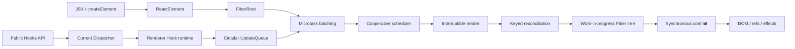

# Koact

[](https://github.com/kogorou0105-bit/koact/actions/workflows/ci.yml)

Koact 是一个使用 TypeScript 从零实现的 React-like Runtime，用于研究 Fiber、协调、调度、Hooks 和 Commit 生命周期。项目从 Didact 的教学模型出发，进一步实现了多 Root、Keyed Diff、环形 UpdateQueue、自动批处理和 Fiber 树可视化。

> Koact 面向原理学习和实验，不以兼容 React 生态或生产环境为目标。

## 核心能力

| 模块 | 已实现能力 |
| --- | --- |
| Element | JSX、文本节点、数组与空节点归一化、Fragment、函数组件 |
| Fiber | Begin/Complete 深度优先遍历、current/WIP 隔离、`childLanes` 聚合 |
| Scheduler | Sync 微任务、可中断 Host Callback、Lane 抢占、跨 Root 优先级与公平轮转 |
| Reconciler | 基于 key 与 type 的节点复用、移动检测、删除收集、DOM identity 保持 |
| Hooks | `useState`、`useEffect`、`useMemo`、`useCallback`、`useRef`、Hook 顺序校验 |
| State | O(1) 入队的环形 UpdateQueue、函数式更新、按 Lane 跳过与 Rebase |
| Batching | 同一 JavaScript 回调中的多次更新只安排一次 Root flush |
| Commit | DOM 更新与排序、effect cleanup/setup、ref detach/attach、完整卸载 |
| DevTools | Commit 探针与 Fiber 树可视化 Vite 插件 |

## 工作流程



Render 阶段可以在 deadline 耗尽时暂停和恢复。Commit 阶段保持同步，只有完整 WIP 树能够发布为 current。Render 期间到达的新更新会使旧版本结果失效，但已进入 UpdateQueue 的 action 不会因为 WIP 被丢弃而丢失。

## 包结构

| 路径 | 职责 |
| --- | --- |
| `packages/react` | Element 模型、Fragment、Hooks 公共 API 与 Dispatcher |
| `packages/react-dom` | Scheduler、Reconciler、DOM、Hooks 和 Commit 实现 |
| `packages/vite-plugin-koact-devtools` | 注入 Fiber 树可视化面板 |
| `packages/ko-vite` | 独立的 mini-vite 实验 |
| `examples` | Todo、Fragment、Ref 和性能示例 |

`@koact/react` 不依赖 DOM。Hooks 的公共 API 通过 Dispatcher 转发到当前 Renderer，实现核心接口与宿主实现的解耦。

## 本地运行

要求 Node.js `^20.19.0 || >=22.12.0` 和 pnpm `10.27.0`。

```bash
pnpm install --frozen-lockfile
pnpm dev:todo
```

基本用法：

```tsx
import React from "@koact/react";
import { startTransition } from "@koact/react";
import { createRoot } from "@koact/react-dom";

const root = createRoot(document.getElementById("root")!);
root.render(<App />);

// scope 同步执行期间产生的 state 更新会标记为 TransitionLane。
startTransition(() => setFilter(nextFilter));

// 卸载时会清理 state queue、effects 和 refs。
root.unmount();
```

`ReactDOM.render(element, container)` 仍然可用，并与 `createRoot` 共享同一套多 Root 调度实现。

## 质量门禁

```bash
# 类型检查、覆盖率测试、Todo lint、全部示例构建
pnpm check

# 快速检查核心包
pnpm check:core
```

当前基线为 7 个测试文件、58 个测试，覆盖按 Lane 分轮 Render、抢占与 Rebase、`childLanes` 聚合、跨 Root 优先级和公平轮转、批处理、中断恢复、Keyed DOM identity、effect/ref 生命周期及异常隔离。Vitest 全局覆盖率门槛为：

| Statements | Branches | Functions | Lines |
| ---: | ---: | ---: | ---: |
| 85% | 80% | 90% | 85% |

GitHub Actions 会在 push 和 pull request 中使用冻结锁文件重复执行上述检查。

## 批处理语义

同一同步调用、原生事件回调、Promise 回调或 timer 回调中的多次 setter 会先进入共享队列，再通过一个微任务安排 Root 工作。批处理只减少 Render/Commit 次数，不会合并或覆盖 action。

如果宿主渲染尚未开始，来自后续回调的工作仍可能被同一个 Root 调度合并；Koact 不承诺每个 macrotask 必然产生一次独立 Commit。

## 当前边界

- `startTransition` 已能为同步 scope 内的 state 更新分配 `TransitionLane`，调度器会跨 Root 选择最高优先级，并允许高优更新替换 Host Callback、抢占低优 WIP；尚未实现到期时间和饥饿任务升级。
- 尚未实现 Suspense、Error Boundary、Context、SSR、Hydration 或 Server Components。
- `useEffect` 在 Commit 中同步执行，尚未拆分 layout 与 passive effect 阶段。
- DOM 事件使用逐节点原生监听，尚未实现 Root 事件委托和合成事件。
- Commit 当前会同步校准宿主子树，尚未使用 `subtreeFlags` 做精确增量遍历。

## 项目路线图

- [项目路线图](./docs/project-roadmap.md)：按优先级维护待办、验收标准和完成状态。
- [现代更新机制实施计划](./docs/modern-react-roadmap.md)：记录 Lanes、`startTransition`、Update Rebase 和 Fiber Bailout 的底层设计。

## 设计来源

- [Build your own React](https://pomb.us/build-your-own-react/)
- [Didact](https://github.com/pomber/didact)
- [React](https://github.com/facebook/react)
